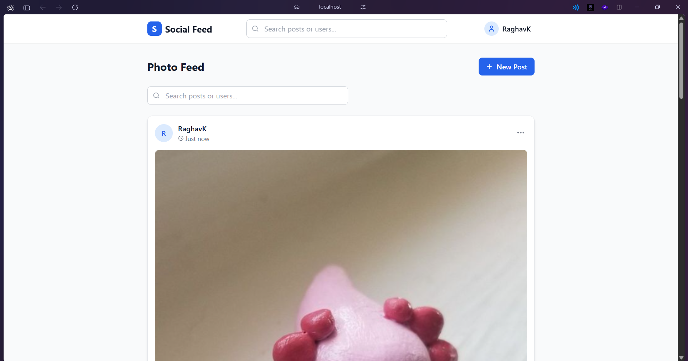
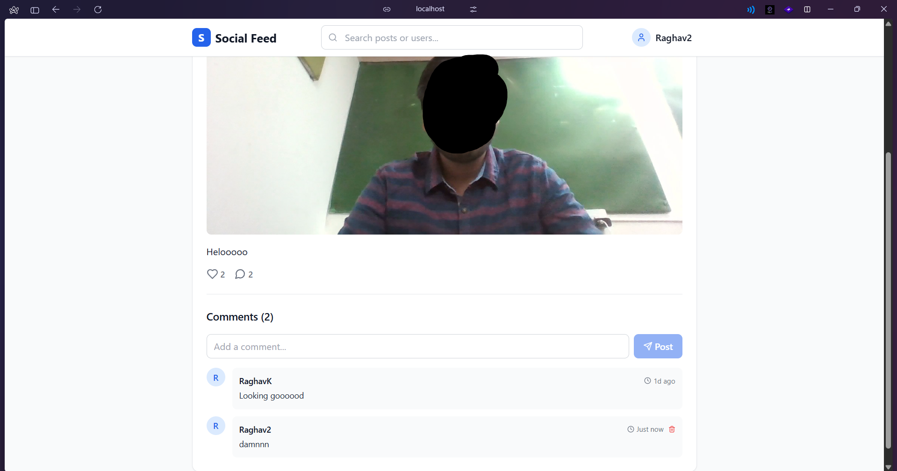
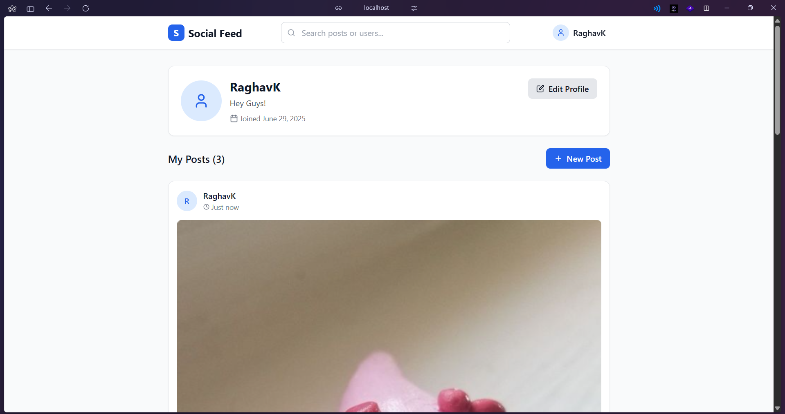
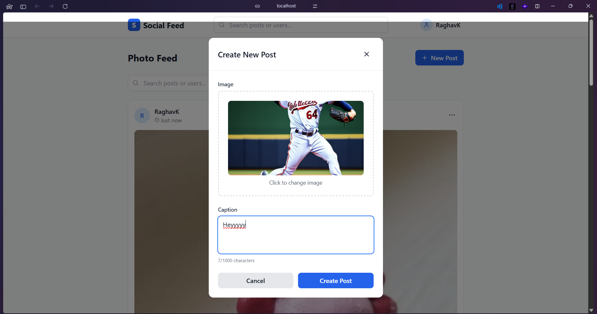

# ShutterSocial

A modern, full-stack social media platform for sharing photos, built with React, Node.js, Express, and MongoDB. This project features authentication, image uploads, likes, comments, search, and a clean, responsive UI.

---

## 📸 Screenshots

| Feed Page | Post Detail | Profile Page | New Post |
|-----------|-------------|--------------|-------------|
|  |  |  |  |

- **Feed Page:** Browse all posts, search, like, and comment.
- **Post Detail:** View a single post with comments and interactions.
- **Profile Page:** View and edit your profile, see your posts.
- **New Post:** Upload a new photo with a caption.

---

## 🚀 Features

- **JWT Authentication**: Secure register/login, password hashing with bcrypt, protected routes
- **Photo Feed**: Upload images with captions, edit/delete your own posts, images stored locally
- **Social Interactions**: Like/unlike posts, add/delete comments, see like/comment counts
- **User Profiles**: View your posts, edit your profile, see join date and bio
- **Search & Pagination**: Search posts by caption or author, paginated feed
- **Modern UI/UX**: Responsive, mobile-friendly, clean Tailwind CSS design
- **RESTful API**: Well-structured endpoints, error handling, and validation

---

## 🛠️ Tech Stack

### Backend
- **Node.js** + **Express**
- **MongoDB** + **Mongoose**
- **JWT** for authentication
- **bcryptjs** for password hashing
- **Multer** for image uploads
- **CORS**, **dotenv**, **express-validator**

### Frontend
- **React 18** + **Vite**
- **React Router DOM** for routing
- **Axios** for HTTP requests
- **Context API** for auth state
- **Tailwind CSS** for styling
- **Lucide React** for icons

---

## 📁 Project Structure

```
ShutterSocial/
├── server/                 # Backend API
│   ├── models/            # Mongoose schemas (User, Post)
│   ├── routes/            # Express routes (auth, posts)
│   ├── middleware/        # Auth middleware
│   ├── uploads/           # Uploaded images
│   └── index.js           # Server entry point
├── client/                # React frontend
│   ├── src/
│   │   ├── components/    # UI components
│   │   ├── pages/         # Page components
│   │   ├── context/       # Auth context
│   │   ├── services/      # API logic
│   │   └── App.jsx        # Main app
│   └── package.json
├── package.json           # Root scripts
├── README.md              # This file
└── .gitignore
```

---

## ⚡ Getting Started

### Prerequisites
- Node.js (v16+ recommended)
- MongoDB (local or cloud)

### 1. Clone the repository
```bash
# Clone and enter the project
$ git clone <repo-url>
$ cd ShutterSocial
```

### 2. Backend Setup
```bash
$ cd server
$ npm install
# Copy and edit environment variables
$ cp env.example .env
# Edit .env for your MongoDB URI and JWT secret
```

### 3. Frontend Setup
```bash
$ cd ../client
$ npm install
```

### 4. Start Development Servers
```bash
# In project root, run both servers concurrently
$ npm run dev
# Or run separately:
$ cd server && npm run dev
$ cd ../client && npm run dev
```

### 5. Open in Browser
- Frontend: [http://localhost:3000](http://localhost:3000)
- Backend API: [http://localhost:5000/api](http://localhost:5000/api)

---

## 📝 Usage

- **Register/Login**: Create an account or sign in
- **Feed**: Browse, search, and interact with posts
- **Create Post**: Upload a photo with a caption (button on Feed/Profile)
- **Like/Comment**: Like/unlike posts, add/delete your own comments
- **Profile**: View and edit your profile, see your posts
- **Search**: Find posts by caption or author name
- **Logout**: End your session securely

---

## 🔌 API Endpoints

### Auth
- `POST   /api/auth/register`   Register new user
- `POST   /api/auth/login`      Login
- `GET    /api/auth/me`         Get current user
- `PUT    /api/auth/profile`    Update profile

### Posts
- `GET    /api/posts`                   Paginated feed (search, page, limit)
- `POST   /api/posts`                   Create post (image + caption)
- `GET    /api/posts/:id`               Get single post
- `PUT    /api/posts/:id`               Edit post (author only)
- `DELETE /api/posts/:id`               Delete post (author only)
- `POST   /api/posts/:id/like`          Like/unlike post
- `POST   /api/posts/:id/comments`      Add comment
- `DELETE /api/posts/:id/comments/:cid` Delete comment (author only)
- `GET    /api/posts/user/:userId`      Get posts by user

---

## 🎨 Customization

- **Styling**: Edit `client/src/index.css` or `tailwind.config.js`
- **API**: Add new routes/controllers in `server/routes/`
- **Components**: Add new UI in `client/src/components/`
- **Models**: Extend schemas in `server/models/`

---

## 🚀 Deployment

### Backend
- Set environment variables on your server
- Deploy to Heroku, Railway, Render, etc.
- Ensure MongoDB is accessible

### Frontend
- Build: `cd client && npm run build`
- Deploy `client/dist` to Vercel, Netlify, or similar

---

## 🤝 Contributing

1. Fork the repo
2. Create a feature branch
3. Make changes and test
4. Submit a pull request

---

**Happy coding! 🚀** 